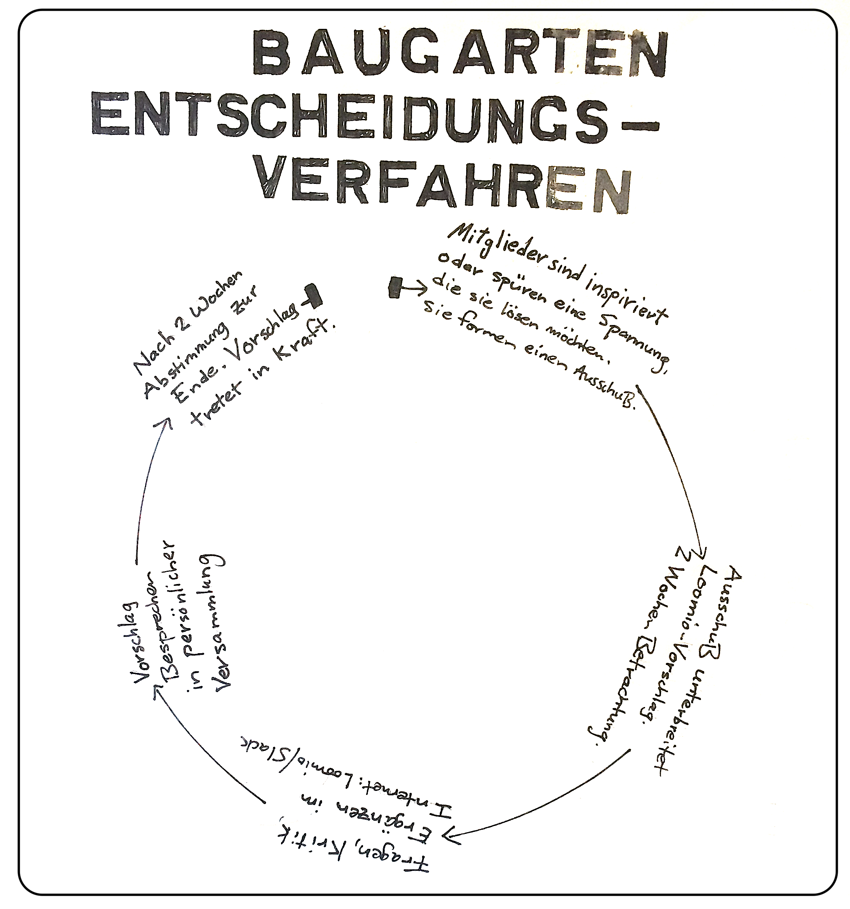

#Die Baugartenverfassung
"Vigeamus ubi orta libertas"

##Präämbel
Kreative Köpfe Europa, erwachet! Wir Kreativitätshebammen gebären eine Gemeinschaft neuer Arbeitsformen, die die Arbeitswelt stürmen werden.

Baugarten ist ein schwungvoller Garten des Bauens. Wir sind die Ort, zu der du, beim Aufwacken in der Morgendämmerung des Arbeitstages, hinzugehen _freust_. Wir sind ein selbst-regierter Raum der freien Wagnisse, des freien Erfindens, Erkundens, Experimentierens, Lernens, Unterrichtens, Denkens, Dichtens, Scheiterns und Siegens.

##Versammlung
###Versammlungsregelmäßigkeit
Wir versammeln uns persönlich für 15-30 Minuten alle zwei Wochen am Mittwoch um 0900 Uhr, um gemeinsam über Entscheidungen zu debattieren.

###Versammlungsprotokoll
Der Moderator fängt die Versammlung an. Er wendet das folgende Protokoll an und stellt die folgenden Fragen:

1. Anmelden. "Wie geht's dir heute?" Jeder Teilnehmer hat 1 Minute, von sich selber zu erzählen.
2. Nachrichten. "Wer hat heute Nachrichten, entweder bezüglich deines Projekts oder Baugarten?" Wer sie hat, kann sie kurz (Maximum 2 Minuten) erklären.
3. Der Moderator erklärt, welche Vorschläge nach ihrer 2-Wochen Diskussionszeit in Kraft treten und welche Mitglieder sie ins Leben rufen.
4. Neue Vorschläge besprechen. Siehe "2 Schritt: Vorschlag bei Versammlung besprechen" für ein detailliertes Gesprächsprotokoll, in dem Fall von einem neuen oder laufenden Ausschussvorschlag.
5. Abmelden. Jeder Teilnehmer kann kurz etwas als Schlusswort äußern, z.B., "Ich mochte die Geschwindigkeit von diesem Treffen". 1 Minute.
 
##Konsens-basierte Entscheidungsverfahren

Welche mitreißenden Kräfte bringen uns in Schwung? Beziehungsweise wie treffen wir als Kollektiv Entscheidungen? 

Wir wenden systemische Konsensfindung an, um Entscheidungen zusammen zu treffen, die auf unsere unterschiedlichen Stimmen vereinen, uns bewegen und den Schwungrad unserer gesammelten Kräften in Gang setzt.

####Ausschüsse
Wenn wir eine Verbesserungsmöglichkeit entdecken, dann bilden wir einen Ausschuss, um diese Frage zu erkunden. Der Ausschuss veröffentlicht im Loomio Tool (siehe unten) einen Vorschlag.

Nachdem das Baugartenkollektiv den Vorschlag entweder ablehnt oder dieser in Kraft tritt -- und der Ausschuss und Ja-stimmenden Mitglieder die entsprechenden Projektaufgaben erledigt haben -- löst sich der Ausschuss auf.

###1. Schritt: Vorschläge Online teilen im Slack mit Loomio
Ein Ausschuss hat zwei Schritte, um einen Vorschlag in Schwung zu bringen. Der erste Schritt ist, den Vorschlag auf dem Online-Werkzeug "Loomio" als "Thread" zu verteilen. Beim Loomio können alle Baugarten-Mitglieder den Vorschlag für **zwei Wochen** ansehen, befragen und kritisieren. Als "Thread" hat der Ausschuss mehrere Polls und Abstimmungswerkzeuge, um Einsprüche und mögliche Übereinstimmungen zu einzuholen.

Aus zwei Gründen verwenden wir Loomio:

Grund #1: Um eine Aufzeichnung von unserer Entscheidungen und Diskussion zu erschaffen.
Grund #2: Denn es kommt vor, dass das ein oder andere Baugartenmitglieder am Mittwoch bei der persönlichen Versammlung fehlt. Durch Loomio haben auch diese Mitglieder die Gelegenheit, Vorschläge anzusehen.

1. Auf Loomio ein Thread Erschaffen
2. Auf Loomio ein Vorschlag auf dem Thread Erschaffen
3. Über die Slack "Herrschaft"-Kanäle sehen die Baugartengenosseninnen den neuen Vorschlag an. Dazu schreiben sie darüber ihre Kommentaren.

###2. Schritt: Vorschlag bei Versammlung besprechen
Der zweite und letzte Schritt, damit ein Ausschuss einen Vorschlag ins Leben ruft, ist, ihn in einer persönlichen Baugartenversammlung zu unterbreiten. Dafür gibt es der folgende Gesprächsordnung:

1. Vorschlag Präsentieren - Der Ausschuss beschreibt das Problem, das er sah, und die Lösung, die er vorschlägt
2. Fragen klären - Jeder kann Fragen stellen. Der Ausschuss kann antworten
3. Reaktionsrunde - Jede Person kann auf den Vorschlag reagieren, wie sie es für richtig hält. Keine Diskussion oder Antworten
4. Abänderung und Erläuterung - Der Ausschuss kann optional die Absicht klären oder den Vorschlag basierend auf den Reaktionen ändern. Keine Diskussion erlaubt
5. Loomio Abstimmungs- und Einwandsrunde - Der Moderator liest die so weit angemeldete Loomio-Abstimmung (siehe die vier mögliche Stimmen unten). Mitglieder, die einen Einwand gemeldet haben, erklären ihre Einwände und was sie mit dem Ausschuss machen, um zusammen eine kreative Lösung zu finden. Es gibt keine Diskussion, es sei denn wenn ein Mitglieder ein Veto angelegt hat. In dem Fall prüfen alle Mitglieder zusammen, ob das Veto gerechtfertigt ist. Es gibt danach drei Möglichkeiten:

#####Das Veto ist gerechtfertigt 
Wenn Mitglieder dieses Veto gerechtfertigt finden, dann ist der Vorschlag abgelehnt. Der Ausschuss kann natürlich sich noch ein mal treffen, um einen neuen Vorschlag, der das Veto anspricht, neu zu formulieren.

#####Veto-Rechtfertigungs-Meinungsverschiedenheiten
Im Fall von stark unterschiedliche Meinungen bezüglich der Vetorechtfertigung suchen sich die versammelte Mitglieder einen Termin, um gemeinsam verschiedene Visionsansichten an Baugarten zu besprechen. Dadurch können wir verstehen, warum da ein Missverständnis entsteht.

#####Das Veto ist nicht gerechtfertigt
Falls Mitglieder das Veto als nicht-gerechtfertigt finden, wird die Stimme als "Nein und..." kategorisiert.

Hilfreich bei der persönlichen Versammlung ist es, wenn die Gemeinschaft einen Raum von Vertrauen und Zuhören erschafft, und Mitglieder den Mut finden, sich ehrlich zu äußern.

###3. Schritt: Ausschuss Integration im Fall von Einwänden
In dem Fall, dass es ein oder mehrere Einwände gibt, verpflichten sich die verneinenden Mitglieder ihre Einwände mit dem Ausschuss zusammen zu besprechen. Ziel ist es, einen geänderten Vorschlag zu erarbeiten, der den Einspruch nicht hervorruft, aber dennoch das Ziel / Problem des Antragstellers erreicht / löst. Konzentrieren Sie sich nacheinander auf jeden Einwand.

####Konsens finden - durch Abstimmungsprotokoll
Statt eines Ja/Nein-Abstimmungsverfahren -- die die Minderheitsstimmen überwinden und überhören -- verwenden wir ein systemisches Konsensfindungs-Protokoll, das in Loomio eingebaut ist, die auf die Stärke eines jeden Mitgliedes Vorschlagswiderstandes leitet.

**Ja** (Loomio "Agree") - Ich will, dass wir diesen Vorschlag in Kraft tritt. Ich habe das gleiche Bedürfnis und ich beteilige mich, ihn ins Leben zu rufen.

**Sich Enthalten** (Loomio "Abstain") -  Ich erkläre mich einverstanden mit dem Ausschuss und ihren entsprechenden Vorschlag. Gleichzeitig betrifft mich der Vorschlag eben nicht, oder ich finde es nicht wichtig, oder ich beteilige mich nicht, ihn ins Leben zu rufen. Ich enthalte mich der Durchführung, aber ich trage sie mit. Ich respektiere die Entscheidung des Ausschusses. Wenn man innerhalb der zwei Wochen Kommentarfrist keine andere Stimme in Loomio angelegt hat, wird die Stimme automatisch als "Sich Enthalten" gemeldet.

**Einwände**
**Nein, und...** (Loomio "Disagree") - Ich will nicht, dass wir diesen Vorschlag umsetzen. Obwohl ich möglicherweise den Bedürfnis des Ausschusses verstehe, habe ich noch einen Einwand bezüglich der Art und Weise, wie der Ausschuss diesen Vorschlag umsetzen möchte. **"Und... was wäre wenn"**: ich verpflichte mich eine Alternative vorzuschlagen. Beziehungsweise verpflichte ich mich durch das Anlegen dieser Stimme, zusammen mit dem Ausschuss eine kreative Alternativ-Lösung zu finden. 

Nachdem die zwei streitende Parteien eine Lösung gefunden haben, wird der Ausschuss den neuen, ergänzenden Vorschlag für eine zweite Kommentar-Runde frisch veröffentlichen.

**Veto** - (Loomio "Block") Ich finde, dass diese Entscheidung der Verfassung oder dem Sinn von baugarten als freies Kollektiv widerspricht. Im Fall von einem Veto, prüfen alle Mitglieder zusammen, ob dieses Veto in diesem Zusammenhang gerechtfertigt ist. (Siehe "2. Schritt: Vorschlag bei Versammlung besprechen" für das Protokoll).

##Freies Denken, freies Dichten
Der Anfang des Denkens ist Uneinigkeit. Gemeinschaften, die den Geist der aufgeschlossenen Anfragen und konstruktives Uneinigkeit nähern, erleben eine Blütezeit. Uneinigkeit, unabhängiges Urteil und die befragen Annahmen blühen innerhalb einer Umgebung diversen Ansichten und die größte Freiheit.

Baugarten garantiert alle Genossenen die größtmögliche Freiheit, zu denken, sich zu äußern, zu schreiben, herauszufordern und zu befragen. Wir sind eine misstönende Sinfonie, ein aufeinanderprallendes Theater, ein College und ein Parlament des freien Denkens. 